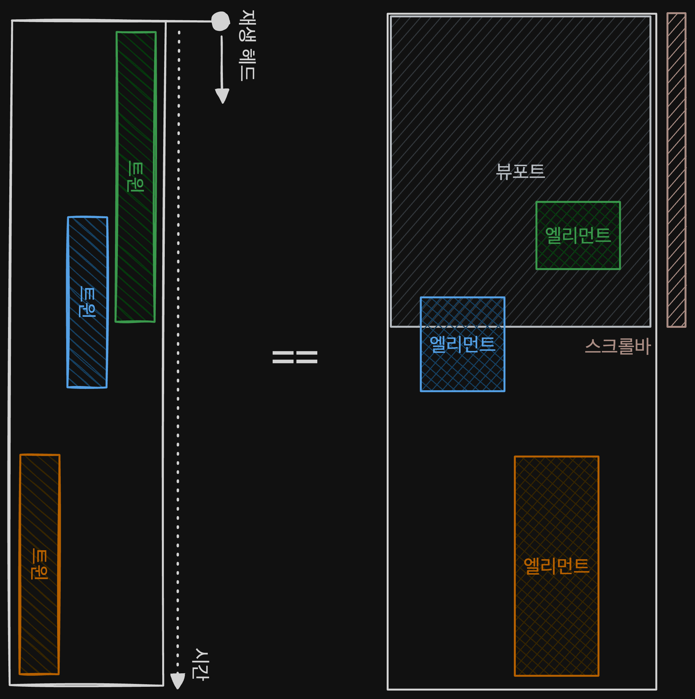

## 시작하며

[Remix](https://remix.run/) 나 [당근 리브랜딩 페이지](https://brandnew.daangn.com/)를 보며 나도 이런 인터렉티브한 페이지를 만들고 싶다고 생각했다. 그래도 프론트엔드 개발자인데, 위와 같은 페이지를 어떻게 만들어야 할지 모르는 것 조금 마음에 안들었던거 같다.

그래서 설날부터 [GSAP](https://gsap.com/)이라는 애니메이션 라이브러리를 찾아 공부를 했다.

이 글은 GSAP 사용 설명서로서의 글이 아니고 GSAP을 공부하며 GSAP에서 어떻게 애니메이션을 다루는지에 대해 나름대로 얻은 멘탈 모델을 정리하는 글이다.

## 시간 기반 애니메이션

애니메이션은 기본적으로 시간을 기준으로 작동한다. 따라서 하나의 커다란 애니메이션을 분석할 때는 일종의 타임라인을 그려 각각의 작은 애니메이션이 어느 시점에 시작되고 끝나는지를 파악할 수 있다.

반대로 생각해보면, 여러 작은 애니메이션들을 타임라인에 적절히 배치하는 과정을 통해서 원하는 애니메이션을 만들 수도 있다는 것이다.


GSAP에서는 이러한 시간 기반 애니메이션을 다루기 위한 여러 개념들을 소개한다.

### Tween

`Tween`은 하나의 애니메이션 그 자체를 의미하면서 애니메이션의 기본 작업 단위이다.

```js
const tween = gsap.to(
  // 애니메이션을 적용시킬 엘리먼트
  targets,
  {
    // 애니메이션을 적용시킬 css 속성
    x: 200,
    rotation: 360,
    // 애니메이션 속성
    duration: 2,
    // 사이드 이팩트를 위한 핸들러
    onComplete: () => { ... },
    onUpdate: () => { ... }
  }
)
```


### Timeline

여러 `Tween`을 하나의 타임라인으로 연결하여 더 커다란 작업단위를 만든다. 위에서 얘기했던 타임라인과 개념이 같다.

```js
const tl = gsap
  .timeline()
  .to(target1, { ...props })
  .to(target2, { ...props }, '<')
  .to(target3, { ...props }, '+=1')
```

`Timeline`은 여러 개의 관련된 `Tween`을 연결하여 타임라인 상에서 위치를 정확히 제어할 수 있게 한다. 이것은 하나의 작업 단위로서 여러 독립적인 `Tween`을 관리하는 번거로움을 없애 주며, 더욱 정교한 제어를 가능하게 한다.


### Keyframes

하나의 `Tween` 안에서 애니메이션이 적용되는 css 속성들이 제각각 변경 지점이 다를 때 사용한다.

```js
const tween = gsap.to(target, {
  keyframes: {
    '0%': { ...props },
    '25%': { ...props },
    '75%': { ...props },
    '100%': { ...props },
  },
  duration: 2,
})
```

`Keyframes`를 사용하면 각각의 css 속성을 따로 컨트롤하기 위해 새로운 `Tween`들을 생성하고 타임라인에 적절히 배치해야 할 필요가 없어진다.

하나의 `Tween` 안에서 각각의 css 속성들을 독립적으로 보는 암시적인 타임라인을 만든다고 생각할 수 있다.


### Stagger

하나의 `Tween`이 여러 엘리먼트 타겟을 가지고 있는데, 각각의 엘리먼트들에 순차적으로 애니메이션을 주고 싶을 때 사용한다.

```js
const tween = gsap.to(targets, {
	...,
  stagger: 1, // 1초의 간격으로 애니메이션을 순차 실행
});
```

`Stagger`를 사용하면 각각의 엘리먼트를 따로 컨트롤하기 위해 새로운 `Tween`들을 생성하고 타임라인에 적절히 배치해야 할 필요가 없어진다.

하나의 `Tween` 안에서 엘리먼트들의 애니메이션을 재배치하는 암시적인 타임라인을 만든다고 생각할 수 있다.


## 스크롤 기반 애니메이션

스크롤 기반 애니메이션은 스크롤에 따라 애니메이션이 작동하는 것을 말한다.

우리에게 가장 익숙한 스크롤이 뭘까? 아마 브라우저 스크롤일 것이다. 브라우저를 먼저 보자.

### 브라우저 다시 생각해보기

먼저, 타임라인을 90도 시계방향으로 돌려서 브라우저와 비교해보자.



살짝 억지스럽긴 하지만 타임라인이 브라우저와 비슷해보이지 않나?

여기서 스크롤바는 전체 페이지 애니메이션의 재생 헤드 역할을 한다. 즉, 스크롤바를 내리면 스크롤바의 위치에 맞게 페이지 컨텐츠를 모두 담고있는 루트 엘리먼트가 알맞은 길이로 위쪽으로 끌어올려지는 애니메이션이 작동한다고도 생각할 수 있다.

#### 스크롤바와 엘리먼트의 위치가 가지는 의미

스크롤 기반 애니메이션은 브라우저 스크롤바가 애니메이션 동작의 기준이 된다. 이에 따라 스크롤바는 중요한 역할을 수행하며, 상황에 따라 두 가지 의미가 있다.

1. 애니메이션 재생 헤드 (playhead)  
   애니메이션이 스크롤바를 따라 작동한다.
2. 애니메이션 트리거  
   스크롤바가 특정 위치에 도달했을 때 애니메이션을 실행시킨다.

또한, 애니메이션이 적용되는 엘리먼트의 위치가 중요한 의미를 갖는다. 엘리먼트의 위치와 스크롤바의 위치 사이의 관계가 애니메이션이 어떻게 동작해야 하는지를 나타내기 때문이다.

엘리먼트가 뷰포트에 들어오지도 않았는데 애니메이션을 실행시키는 것은 사실상 의미가 없다. 일단 엘리먼트에 스크롤바가 도달해야 애니메이션을 트리거하거나 스크롤 위치에 맞게 재생할 수 있다.


초록색 트윈과 파란색 트윈은 트리거로서의 스크롤 애니메이션을 표현했고, 주황색 트윈은 재생 헤드로서의 스크롤 애니메이션을 표현했다.

#### 뷰포트 기준의 가상의 스크롤바

사실 위에서의 이미지는 개념을 쉽게 설명하기 위해 과하게 추상화된 면이 있다. 브라우저의 스크롤바 하나 가지고 페이지에 있는 모든 스크롤 기반 애니메이션을 다루기에는 한계가 있다.

모든 스크롤 기반 애니메이션은 더 정교한 컨트롤을 위해 뷰포트를 기준으로 하는 각각의 가상의 스크롤바를 갖는다.


트윈들은 각각이 가지고 있는 가상의 스크롤바와 애니메이션을 적용할 엘리먼트의 위치 관계를 고려하여 애니메이션을 컨트롤하게 된다.

### Scroll Trigger

GSAP은 트리거로서의 스크롤바를 기본값으로 하며 scrub 속성을 통해 재생 헤드로서의 스크롤바를 사용할 수 있다.

```js
const tween = gsap.to(target, {
  scrollTrigger: {
    trigger: '엘리먼트',
    start: '엘리먼트_시작위치 뷰포트_스크롤바_시작위치',
    end: '엘리먼트_끝위치 뷰포트_스크롤바_끝위치',
    scrub: number | boolean, // 재생 헤드로서의 스크롤 기반 애니메이션을 사용 여부
    // ...
  },
  // ...
})
```

## 끝내며

위의 멘탈 모델을 가지고 여러 인터렉티브한 사이트를 보았을 때 그래도 어떻게 만들면 되겠다는 감을 잡을 수 있었다.

이제 다음 과정은 감을 잡는것을 넘어 실제로 만들어보는 것이다. 바로 다음 글이 될 지는 모르겠지만 실제로 인터렉티브한 웹을 만들어본 경험을 가지고 돌아오겠다.
