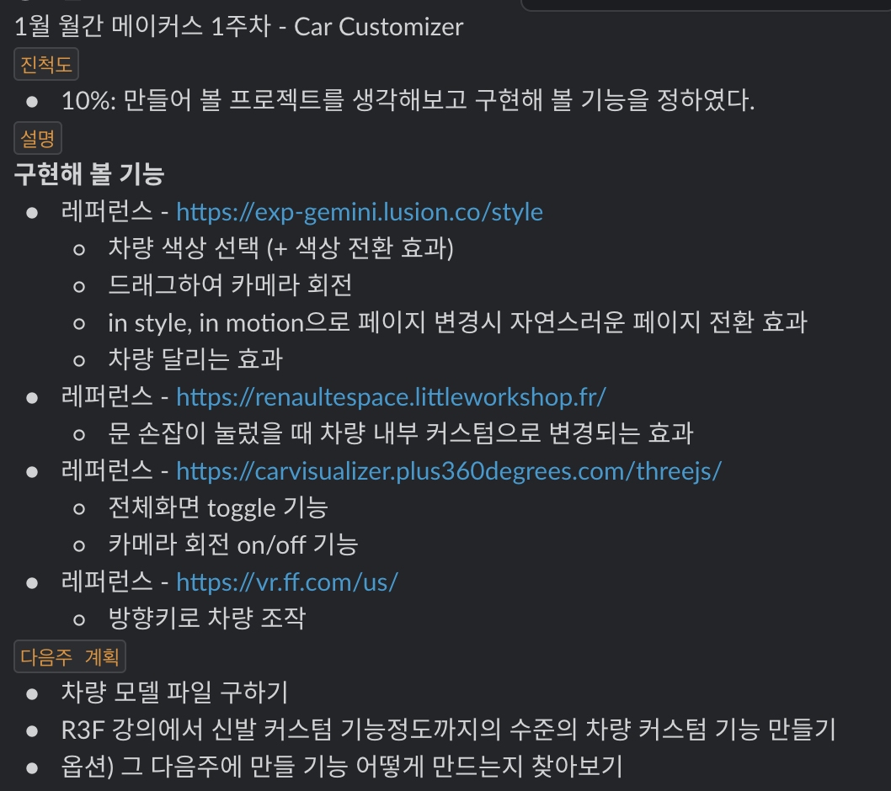
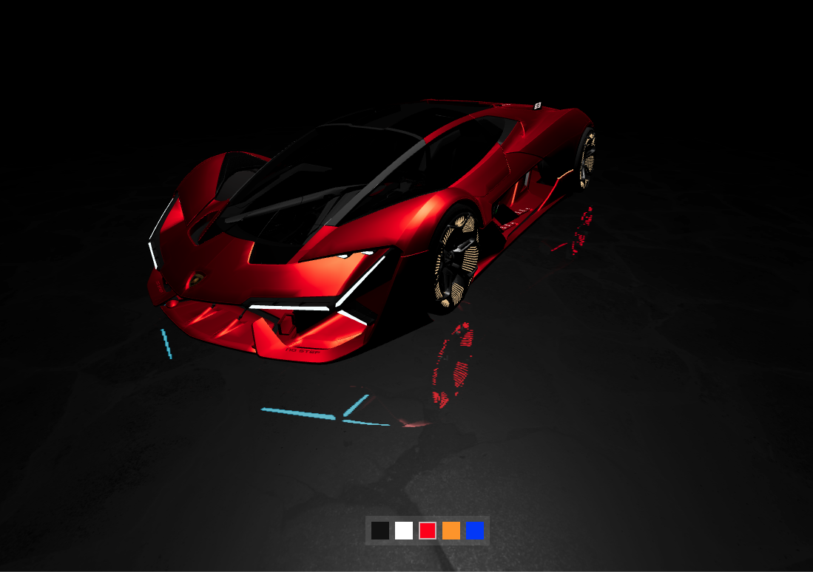

## 시작하며

작년말에 글또 활동을 시작하며 Udemy 강의들을 무료로 수강할 수 있는 기회가 생겼다. 여러 강의들을 살펴보다가 [React Three fiber(R3F)로 배우는 인터렉티브 3D 웹 개발](https://www.udemy.com/course/react-three-fiber-r3f/) 강의에 관심이 생겨 수강하게 되었다. 이번 글은 강의를 수강하면서 한 활동들과 느낀 점 및 수강 후기에 대해 정리해보려고 한다.

## 수강목적

[춘식이 관찰일기](https://www.choonsikdiary.com/)와 같은 페이지를 보면서 언젠가 이와 같은 프로젝트를 만들어보고 싶다는 생각을 했었는데, 이번 기회에 기본적인 내용을 배울 수 있을거 같았다. 또한 글또내에서 이번 강의 관련해서 스터디가 생겨서 첫 스터디로 다른 사람과 함께 재미있게 공부하고 싶었다.

## 첫 스터디

글또에서의 첫 스터디로 6주동안 함께 강의 내용을 정리하며 공유하고 싶은 내용이 있는 경우 발표를 하는 시간을 가졌다. ([스터디 내용 정리](https://janghobin.notion.site/c56760191122411f99ada0f1c152fa1b))

스터디를 하며 다른 스터디원분의 작업물을 보는것이 재미있었고 그것을 구현하며 했던 고민들을 듣는것이 좋았다. ([다른 스터디원의 멋진 작업물](https://prepare-assignment-test.vercel.app/), [과 멋진 후기](https://velog.io/@blcklamb/%ED%86%A0%EC%8A%A4%ED%8E%98%EC%9D%B4%EC%8A%A4%EB%A5%BC-%ED%81%B4%EB%A1%A0%EC%BD%94%EB%94%A9-%ED%95%B4%EB%B3%B4%EC%9E%90))

개인적으로 인생 첫 스터디였는데, 다른 사람들과 공부하며 어느정도 강제성이 생기고 스터디가 끝나갈때 쯤 의미있는 작업물이 남는다는 것에서 스터디의 장점이 체감되었다. ~~과연 혼자 공부하려고 했으면 강의를 다 듣기는 했을까?~~

## 사이드 프로젝트 - Car Customizer

사이드 프로젝트를 만드는 과정은 굉장히 어려웠다. 강의는 강사님이 이끌어주는 대로 따라가기만 하면 됐고 내용도 나름 어렵게 느끼지는 않았는데, 그 내용을 바탕으로 새로운 프로젝트를 만들려고 하니 한순간 한순간이 너무 어렵게 느껴졌다.

처음에는 강의도 다 들었고 패기있게 여러 레퍼런스들([Gemini](https://exp-gemini.lusion.co/style), [LittleWorkshop](https://renaultespace.littleworkshop.fr/), [CarVisualizer](https://carvisualizer.plus360degrees.com/threejs/), [FF 91 Test Ride](https://vr.ff.com/us/))을 참고하며 만들고 싶은 내용을 모두 넣어서 사이드 프로젝트를 기획했었다.

### 수많은 난관들

- 딱 맞는 차량 모델 찾기  
  단순히 멋있는 차량 모델을 구하기는 쉬웠지만 사이드 프로젝트 기획을 만족하는 모델을 찾기는 어려웠다. 차량 바퀴의 전진, 후진, 회전 애니메이션 그리고 차 문이 열리고 닫히는 애니메이션 등등.. 기획 내용을 모두 만족하는 모델을 찾을 수는 없었다.
- 블렌더  
  딱 맞는 차량 모델이 없다는 것은 블렌더로 그러한 애니메이션을 직접 만들어야 하는 것을 의미했다. 이 부분은 강의의 내용을 벗어나는 내용이고 단기간에 필요한 부분만 배우기는 어려웠다.
- 쉐이더  
  결정적으로 레퍼런스로 참고한 작품들 수준의 화려한 효과들은 쉐이더를 공부해야 했다. 쉐이더는 너무 어려운 진입장벽이었다.. ([너무 높은 산](https://thebookofshaders.com/))

### 천리길도 한걸음부터

단순히 강의 조금 듣는다고 만들고 싶은 프로젝트를 만들 수 있는 것은 아니구나! 천리길도 한걸음부터... 라는 생각으로 사이드 프로젝트 기획을 강의 내용을 참고하여 약간의 응용을 하는 수준으로 대폭 축소하였다.

[나의 역사적인 첫 작품](https://car-customizer.pages.dev/)

부족한 부분이 많지만 첫 걸음을 띄었다고 생각한다. 다음엔 조금 더 잘만들겠지...

## 오픈소스 기여

[Drei 오픈소스 기여](https://github.com/pmndrs/drei/pull/1772)

사이드 프로젝트 진행중에 @react-three/drei의 `<CameraControls />` 컴포넌트가 사용되지 않는 prop을 너무 많이 가지고 있어 그 부분을 제거하는 PR을 올렸는데 그것이 적용이 되었다. 아주 사소한 기여지만 처음 기여를 해보는 것이었기에 굉장히 의미있는 순간이었다.

## 수강후기

### 좋았던 점

- 짧은 러닝타임으로 Three.js나 R3F의 기본적인 내용들을 빠르게 학습할 수 있었다.  
  이 강의가 아니었다면 Three.js나 R3F 공식문서를 보고 여러 실험을 해보며 시행착오 속에서 학습해야 했는데 그런 시간을 줄여줄 수 있다. (Three.js 공식문서를 보면 알겠지만.. 레퍼런스를 읽는다고 쉽게 와닿는 내용이 아니다..)
- [나이키 신발 커스텀 페이지](https://www.nike.com/u/custom-nike-dunk-high-by-you-shoes-10001796/7687279580#Builder)에서의 기능과 비슷하게 실제 프로젝트를 함께 해봄으로써 사이드 프로젝트를 어떻게 만들어야 할 지에 대한 감을 잡을 수 있었다.

### 아쉬웠던 점

- 바닐라 자바스크립트로 Three.js만 활용하여 강좌가 진행이 됐으면 어땟을까?  
  강의를 다 듣고 개인적으로 든 생각인데, 리액트 기반으로 R3F를 사용하면서 @react-three/drei에 너무 의존하게되는 느낌이 들었다.
- 조금 더 심화 내용이 있었으면 좋겠다.  
  강의에서 배운 내용 정도로는 생각했던 것만큼의 프로젝트를 만들 수 없었다. ~~조금만 더 업어주세요..~~  
  쉐이더에 대한 아주 기초적인 내용이 들어있었으면 좋았을 거 같다.

### 결론

처음 시작하는 사람들에게 정말 좋은 입문용 강의! 하지만 스스로 추가적인 학습은 필요하다.

> 해당 콘텐츠는 유데미로부터 강의 쿠폰을 제공받아 작성되었습니다.
